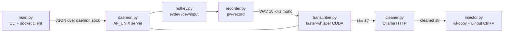

# Repository Guidelines

## Project Overview

`voice-flow` is an offline voice-dictation daemon for **Linux + Wayland**. A global hotkey records
audio, Whisper transcribes it on CUDA, a local LLM cleans it up, and the text is injected into the
focused window via clipboard + a virtual keyboard `Ctrl+V`.

Explicit non-goals — do not add code for these:

- **X11 is unsupported.** Injection depends on `wl-copy`/`wl-paste`.
- **No cloud, accounts, or telemetry.** The only outbound traffic is `localhost:11434` (Ollama) plus
  a one-time Whisper model download.
- **Not memory-optimised.** Models stay resident (~2.5 GiB VRAM, ~1.2 GB RSS) on purpose.
- **No multi-client IPC.** The socket server is single-threaded and strictly one request per
  connection.

## Architecture & Data Flow



Boundary types: hotkey callback (`None`) → WAV file on disk (`str` path) →
`Transcriber.transcribe(path) -> tuple[str, str, float]` (text, language, duration) →
`TextCleaner.clean(str) -> str` → `TextInjector.paste(str) -> bool`.

**Process model.** `daemon.py` is the resident service holding warm STT/LLM models; `main.py` is both
the CLI and the socket client. `main.py` never imports heavy deps at module scope — `Transcriber`,
`TextCleaner`, and `VoiceFlowDaemon` are imported inside `run_standalone_process()` and
`handle_daemon()` so `voice-flow status` stays instant. Preserve this laziness.

**IPC contract.** `AF_UNIX` / `SOCK_STREAM` at `$XDG_RUNTIME_DIR/voice-flow/daemon.sock`,
newline-delimited single-line UTF-8 JSON, one request → one response → close.

| Request                                        | Response                                                                   |
| ---------------------------------------------- | -------------------------------------------------------------------------- |
| `{"action":"ping"}`                            | `{"status":"pong"}`                                                        |
| `{"action":"toggle"}`                          | `{"status":"started"\|"stopped"}`                                          |
| `{"action":"process","audio_path":"/…/x.wav"}` | `{"status":"ok","raw":…,"cleaned":…,"language":…,"pasted":…,"total_ms":…}` |

If the socket is missing or times out, `main.py` catches the failure and falls back to a cold
in-process run via `run_standalone_process()`. Keep that fallback working.

**Concurrency.** `GlobalHotkeyListener` runs one `selectors.DefaultSelector` thread (0.3 s select
timeout, device rescan every 5 s so USB/Bluetooth keyboards hot-plug). Mutable state
(`_active_keys`, `_combo_active`, `_is_recording`, `_tap_started_recording`) is guarded by
`self._lock`. Callbacks are dispatched on throwaway daemon threads so handlers never block the event
loop. Recording state itself lives on disk in `recorder.pid`, probed with `os.kill(pid, 0)`.

## Key Directories

| Path                  | Purpose                                                            |
| --------------------- | ------------------------------------------------------------------ |
| `voice_flow/`         | The entire package — nine flat modules, no subpackages.            |
| `tests/`              | Pytest suite, one file per source module.                          |
| `docs/`               | Zensical/MkDocs site published to GitHub Pages.                    |
| `plans/`              | Engineering plans. **MUST stay outside `docs/`** (see Docs below). |
| `scripts/`            | `benchmark.py` only.                                               |
| `packaging/homebrew/` | Formula source of truth for the `homebrew-voice-flow` tap.         |

## Development Commands

The `Makefile` is the canonical reference; it calls `.venv/bin/*` directly.

```bash
make setup        # uv sync --extra cuda --group dev --group docs, then npm install
make test         # .venv/bin/pytest
make lint         # ruff check . && ruff format --check . && npx prettier --check .
make format       # ruff format . && ruff check --fix . && npx prettier --write .
make docs         # uv run --group docs zensical serve  (:8000)
make docs-build   # zensical build --strict — exactly what CI runs
make restart      # systemctl --user restart voice-flow, then ./voice-flow.sh status
make logs         # journalctl --user -u voice-flow -f
make clean
```

Targeted runs and the live daemon:

```bash
.venv/bin/pytest tests/test_hotkey.py -v
.venv/bin/pytest tests/test_cleaner.py::test_clean_prompt_wrapping_with_spoken_text_tags
.venv/bin/pytest --cov=voice_flow --cov-report=term-missing   # what CI runs

systemctl --user stop voice-flow && ./voice-flow.sh daemon    # foreground debug, real tracebacks
./voice-flow.sh status
```

CLI surface — plain positional dispatch on `sys.argv[1]` in `main()`, **no argparse/typer**; default
is `toggle`: `toggle`, `record-start`, `record-stop`, `daemon`, `status`.

## Code Conventions & Common Patterns

- **Formatting ownership is split.** Ruff owns Python; Prettier owns Markdown/YAML/JSON. Ruff
  `extend-exclude = ["*.md", "plans/"]` exists so the two do not fight over fenced Python in docs.
  Never format `.md` with ruff.
- **Ruff:** `line-length = 110`, `target-version = "py312"`, `select = ["E","F","I","UP","B","C4","SIM"]`.
  Deliberate ignores: `E501`, `B904` (no `raise … from err` in thin wrappers), `SIM105`. Tests also
  ignore `B011`, `SIM117`. No mypy/pyright is configured, but all public functions carry type hints —
  match that.
- **Logging is `print()` with a bracketed component tag** — `[Daemon]`, `[Cleaner]`, `[Hotkey]`,
  `[Injector]`, `[Config]`. `PYTHONUNBUFFERED=1` in the unit sends these to the journal. Do not
  introduce `logging` for one module only.
- **No custom exception hierarchy.** Built-ins only (`ConnectionError`, `OSError`, `TimeoutError`, …).
- **Fail open, never lose the transcript.** `TextCleaner.clean()` must never raise: on non-200,
  timeout, or network error it prints a notice and returns `raw_text` verbatim. `TextInjector.paste()`
  returns `False` rather than raising when `/dev/uinput` is unopenable.
- **No async.** Concurrency is `threading` + `selectors` only.
- **Dependency injection is constructor keyword args with defaults** (`TextCleaner(model=..., temperature=...)`);
  `daemon.py` builds each component from the config dict. There is no DI container and no global singletons.
- **Naming:** modules and functions `snake_case`; components are noun classes (`AudioRecorder`,
  `TextCleaner`, `TextInjector`, `Transcriber`, `GlobalHotkeyListener`, `VoiceFlowDaemon`); private
  helpers take a leading underscore (`_ensure_cuda_libs`, `_set_clipboard`).

### Load-bearing invariants

1. **CUDA import order** (`transcriber.py`): `_ensure_cuda_libs()` must `ctypes.CDLL(…, RTLD_GLOBAL)`
   the bundled cuBLAS/cuDNN `.so` files **before** `from faster_whisper import WhisperModel`. Hoisting
   that import to module top breaks with `libcublas.so.12 is not found`.
2. **`SIGPIPE` stays Python-default in the daemon.** `main()` calls `_restore_default_sigpipe()` only
   when `cmd != "daemon"`; setting `SIG_DFL` in the daemon turns a client disconnect into process
   death instead of a catchable `BrokenPipeError`.
3. **The 350 ms clipboard-restore sleep in `injector.paste()` is a race fix**, not padding. Wayland
   clients read the data offer lazily after `Ctrl+V`; restoring sooner pastes the old clipboard.
4. **One `UInput` device per process.** `TextInjector` creates `voice-flow-virtual-kb` lazily and
   reuses it; per-paste device creation reintroduces a ~50 ms settle race.
5. **`paths.py` is the only module that resolves runtime paths.** It creates
   `$XDG_RUNTIME_DIR/voice-flow` with mode `0700`. Never hardcode paths or use `/tmp` or `/dev/shm`.
6. **Spoken text is wrapped in `<spoken_text>` delimiters** before reaching Ollama — prompt-injection
   containment. Keep the wrapping when editing the cleanup prompt.
7. **Audio is 16 kHz mono WAV.** `pw-record --rate 16000 --channels 1` matches Whisper's expectation.

## Important Files

| File                        | Role                                                                                               |
| --------------------------- | -------------------------------------------------------------------------------------------------- |
| `voice_flow/main.py`        | CLI dispatch, `load_config()`, `send_to_daemon()`, standalone fallback.                            |
| `voice_flow/daemon.py`      | `VoiceFlowDaemon`: socket server, model warm-up, signal handlers, `process_audio`.                 |
| `voice_flow/paths.py`       | Sole authority for runtime dir, socket, PID file, audio path, config resolution.                   |
| `voice_flow/transcriber.py` | Whisper/CTranslate2 wrapper. Excluded from coverage; has no unit tests.                            |
| `voice_flow/injector.py`    | Clipboard + uinput injection; the timing-sensitive module.                                         |
| `config.json`               | Bundled default config and de-facto schema.                                                        |
| `pyproject.toml`            | Deps, entry point, ruff/pytest/coverage/bumpversion config.                                        |
| `voice-flow.sh`             | Launcher: execs `.venv/bin/python -m voice_flow.main "$@"`.                                        |
| `voice-flow.service`        | systemd **user** unit; `PassEnvironment=WAYLAND_DISPLAY XDG_RUNTIME_DIR DBUS_SESSION_BUS_ADDRESS`. |
| `tests/conftest.py`         | Autouse hermeticity fixtures — read before writing any test.                                       |

**Config precedence** (`paths.get_config_path()`, first match wins): `$VOICE_FLOW_CONFIG` →
`${XDG_CONFIG_HOME:-~/.config}/voice-flow/config.json` → bundled `./config.json` → `{}` defaults.
Missing files and JSON parse errors both degrade to defaults; they never raise.

Config keys are grouped `hotkey.*` (`enabled`, `combo`, `hold_threshold_sec`), `stt.*` (`model_size`,
`device`, `compute_type`, `language`), `cleaner.*` (`enabled`, `ollama_url`, `model`, `temperature`,
`timeout_sec`, `keep_alive`), `audio.*` (`sample_rate`, `channels`, `temp_file`), `ui.*`
(`sound_feedback`, `notifications`, `restore_clipboard`). A user-visible key change must land in
`config.json`, `docs/configuration.md`, and `README.md` together.

Installer/uninstaller env vars (`install.sh`, `uninstall.sh` only, not read by the app):
`VOICE_FLOW_DIR`, `VOICE_FLOW_REF`, `VOICE_FLOW_REPO`, `VOICE_FLOW_NO_CUDA`, `VOICE_FLOW_NO_MODEL`,
`VOICE_FLOW_YES`, `VOICE_FLOW_PURGE`, `VOICE_FLOW_KEEP_DIR`.

## Runtime/Tooling Preferences

- **Python ≥ 3.12** (`.python-version` pins `3.12`; CI matrices 3.12 and 3.13). Uses 3.12 syntax such
  as `str | None`.
- **`uv` is mandatory** — `uv.lock` is committed and `uv_build` is the build backend. Never introduce
  `pip install`, `poetry`, or `setup.py`.
- **Node/npm exists only for Prettier** (`package.json` → `voice-flow-tooling`). Do not add runtime JS.
- **Runtime deps are deliberately three**: `evdev`, `faster-whisper`, `requests`, plus the optional
  `cuda` extra (`nvidia-cublas-cu12`, `nvidia-cudnn-cu12`). Justify any addition.
- **System binaries shelled out to:** `pw-record`, `pw-play`, `notify-send`, `wl-copy`, `wl-paste`.
  Kernel interfaces: `/dev/input/event*`, `/dev/uinput` (requires `input` group).
- Version is bumped by `bump-my-version` across `pyproject.toml`, `voice_flow/__init__.py`, and
  `CHANGELOG.md` simultaneously — never hand-edit one of them.
- Branching: feature/fix PRs target `develop`; `main` is release-only, merged `--ff-only`. Commits
  follow Conventional Commits (`feat:`, `fix:`, `docs:`, `chore:`, `ci:`, `build:`, `test:`,
  `refactor:`). User-visible changes go under `## [Unreleased]` in `CHANGELOG.md`.
- Install hooks with `uvx pre-commit install`. Hooks: `ruff --fix`, `ruff-format`, `prettier --write`,
  `end-of-file-fixer`, `trailing-whitespace`, `check-yaml --unsafe`, `check-toml`,
  `check-merge-conflict`, `check-added-large-files --maxkb=512`.

## Testing & QA

Pytest only — no plugins beyond `pytest-cov`, and `addopts = "-q --strict-markers"` means an
unregistered `@pytest.mark.*` is an error. `testpaths = ["tests"]`. Coverage targets `voice_flow` and
omits `voice_flow/transcriber.py`; there is no `fail_under` gate. CI runs `lint`, `test` (3.12 +
3.13), and `build`, all blocking, and installs **no** apt packages — the suite must stay pure.

**The suite is hermetic and must remain so.** Tests must never open `/dev/uinput`, spawn real
`pw-record`, or touch the developer's clipboard. `tests/conftest.py` enforces this with two autouse
fixtures: `isolate_desktop_session` (patches `voice_flow.injector.evdev.UInput`,
`TextInjector._set_clipboard`, `TextInjector._get_current_clipboard`) and `isolate_runtime_dir`
(repoints `$XDG_RUNTIME_DIR` at a temp dir so tests cannot delete the live daemon socket). Verify
hermeticity after touching injector or recorder code:

```bash
printf 'CANARY' | wl-copy && .venv/bin/pytest -q >/dev/null 2>&1 && \
  test "$(wl-paste)" = CANARY && echo "session intact"
```

Patch at the module boundary, using the import site — not the library's origin:

- `voice_flow.recorder.subprocess.Popen` — audio capture is the `pw-record` CLI. There is **no**
  `sounddevice`/`pyaudio` to mock. `tests/test_recorder.py::fake_pw_record` already writes a valid
  silent WAV; reuse it.
- `cleaner.session.post` via `patch.object` — `TextCleaner` holds a persistent `requests.Session()`,
  so patching `requests.post` intercepts nothing.
- `evdev.list_devices`, `evdev.InputDevice`, `selectors.DefaultSelector` for hotkey tests.
- `voice_flow.daemon.Transcriber` / `.TextCleaner` / `.TextInjector` / `.AudioRecorder` /
  `.GlobalHotkeyListener` for daemon tests.
- IPC tests bind **real** `AF_UNIX` sockets under `tmp_path`, serve from a
  `threading.Thread(daemon=True)`, and must call `daemon.stop()` in cleanup to unlink the socket.

Conventions: function-based tests only (no classes), named
`test_<module>_<scenario>_<expected_behavior>`, plain `assert`, `pytest.raises(..., match=...)` for
errors, parametrize used sparingly in favour of one explicit test per invariant. One test file per
source module. `transcriber.py` is untested by design (CUDA weights); `main.py`'s command handlers
(`handle_toggle`, `main`) are the largest genuine coverage gap — `load_config` is covered in
`test_paths.py` and `send_to_daemon` in `test_ipc.py`.

Latency/memory work is measured, not guessed. Stop the daemon first or the benchmark will exhaust VRAM:

```bash
systemctl --user stop voice-flow
.venv/bin/python scripts/benchmark.py   # STT/LLM/total p50, injection, clipboard RTT, RSS+PSS
systemctl --user start voice-flow
```

## Docs

Pages live in `docs/` and **must** be registered in the `nav:` tree of `mkdocs.yml`. Zensical does not
honour `exclude_docs`, so **anything placed under `docs/` is published** — engineering plans therefore
stay in `plans/`. CI builds with `--strict`, so a broken relative link or bad anchor fails the build.
